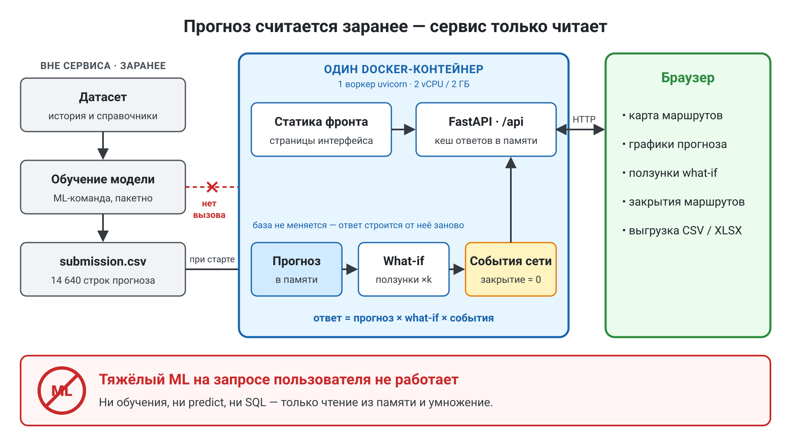

# Архитектура решения

Документ для поля 4 формы сдачи: схема архитектуры и модулей, область
определения модели, зависимости от внешних данных.

---



---

## Принцип

Прогноз считается **пакетно, вне сервиса**, и сохраняется файлом. Веб-сервис
только читает готовые значения из памяти и агрегирует их под запрос. Модель
в момент обращения не работает.

Это даёт мгновенный отклик, снимает риск падения демонстрации на пересчёте
и прямо закрывает нефункциональное требование по производительности.

---

## Цепочка модулей

```
initial_data/                     исходный датасет
   │
   ├─ ml/profile_data.py          разведка: проверка качества данных
   │
   └─ ml/baseline.py              ПАКЕТНЫЙ КОНТУР
         │  ├── чтение labels, достройка полной сетки нулями
         │  ├── детекция ремонтных дней
         │  ├── сезонный профиль, тренд, календарные коэффициенты
         │  └── валидация на двух фолдах
         │
         └─► submission.csv       прогноз: route;date;hour;prediction
                 │
                 ▼
service/backend/app/              ОНЛАЙН-КОНТУР
   │
   ├─ pipeline/ingest.py          приём и нормализация данных
   ├─ pipeline/geo.py             геопривязка: остановки, геометрия маршрутов
   ├─ pipeline/aggregate.py       агрегация: горизонты, маршруты, остановки
   ├─ pipeline/adjust.py          корректирующие коэффициенты (what-if)
   ├─ pipeline/network_events.py  события сети: закрытия, укорочения
   ├─ pipeline/cache.py           кеш ответов
   │
   ├─ api/health.py               живость, метаданные, перезагрузка данных
   ├─ api/reference.py            справочники маршрутов и остановок
   ├─ api/forecast.py             прогноз с фильтрами
   ├─ api/export.py               выгрузка CSV и XLSX
   ├─ api/network.py              события сети: GET, POST, DELETE
   └─ api/factors.py              внешние источники, область применимости
         │
         ▼
service/static/                   фронтенд (карта, графики, коэффициенты)
```

Разделение соответствует требованию рубрики: приём и нормализация данных →
признаки и геопривязка → прогноз и агрегация → API → фронтенд.

---

## Пакетный контур

Запускается вручную, планировщик не нужен.

1. Чтение `labels/labels_day_*.csv` — готовая целевая величина.
2. Построение полной сетки «маршрут × дата × час», пропуски заполняются
   нулями (в файле отсутствуют ночные часы).
3. Детекция ремонтных дней: объём маршрута ниже 35% медианы для этого же
   дня недели.
4. Расчёт сезонного профиля, тренда и календарных коэффициентов.
5. Валидация на двух фолдах, затем переобучение на всей истории.
6. Запись `submission.csv` — того же формата, что уходит на лидерборд.

Один расчёт — два потребителя: файл для сдачи и таблица для сервиса.
Расхождения между сданным результатом и тем, что показывает дашборд,
исключены по построению.

---

## Онлайн-контур

Данные грузятся на старте процесса и держатся в памяти: прогноз 14 640
строк, история около 58 тысяч. Повторяющиеся запросы отдаются из кеша.

Обновление прогноза без перезапуска: заменить `data/submission.csv`
и вызвать `POST /api/reload`. Нужно, когда ML-команда подкладывает
новую версию.

### Точки входа API

| Метод | Путь | Назначение |
|---|---|---|
| GET | `/api/health` | живость, размер данных, статистика кеша |
| GET | `/api/meta` | что загружено, периоды, предупреждения геопривязки |
| POST | `/api/reload` | перечитать файлы без перезапуска |
| GET | `/api/routes` | маршруты, наличие геометрии, исключения |
| GET | `/api/stops?route=` | остановки с координатами |
| GET | `/api/geometry?route=` | геометрия маршрутов в GeoJSON |
| GET | `/api/forecast` | прогноз с фильтрами и агрегацией |
| GET | `/api/forecast/routes` | сводка по маршрутам |
| GET | `/api/forecast/stops?route=` | разложение по остановкам (оценочное) |
| GET | `/api/forecast/compare` | прогноз рядом с фактом |
| GET | `/api/export?format=csv\|xlsx` | выгрузка |
| GET | `/api/export/submission` | выгрузка в формате сдачи |
| GET | `/api/factors` | внешние источники со ссылками |
| GET | `/api/scope` | область определения и адаптации модели |
| GET | `/api/network-events` | активные события сети |
| POST | `/api/network-events` | добавить закрытие, укорочение, ручной множитель |
| DELETE | `/api/network-events/{id}` | снять событие |

Горизонты: `day` — сутки по часам, `month` — месяц по дням, `year` — год
по месяцам.

Корректирующие коэффициенты применяются к любому запросу прогноза и
экспорта: `k_global`, `k_weather` с диапазоном дат, `k_event` с диапазоном,
`k_routes` вида `17:1.1,50:0.8`. Ответ содержит описание применённых
поправок.

События сети — реальное состояние, а не what-if: хранятся на сервере
и действуют для всех. Порядок: база → what-if → события. Активное
закрытие даёт 0 при любых коэффициентах. База (`model_prediction`) не
меняется никогда: ответ каждый раз строится от неё заново. После
добавления или снятия события кеш ответов сбрасывается.

---

## Хранение

Данные помещаются в память процесса, отдельная СУБД не нужна. ТЗ допускает
файловое колоночное хранилище — у нас файловое плюс кеш в процессе.

Единственное изменяемое состояние — события сети: JSON-файл
`data/network_events.json`, в памяти на старте, доступ через
`NetworkEventRepository`. Замена на СУБД трогает только репозиторий.

При росте объёмов схема не меняется: тот же пакетный контур пишет в
Parquet или ClickHouse, API читает оттуда. Для горизонтального
масштабирования события сети выносятся в общее хранилище, и реплики
за балансировщиком читают один и тот же неизменный прогноз.

---

## Производительность

Один контейнер, uvicorn, **один воркер**: состояние (прогноз, кеш,
события сети) живёт в памяти процесса. При двух воркерах добавленное
закрытие видел бы только один из них.

Целевые показатели ТЗ: 2–4 vCPU и 2–4 ГБ RAM, сотни RPS, p95 менее
200–300 мс.

Замер скриптом `loadtest/loadtest.py` — только стандартная библиотека,
два режима: прогретый кеш и холодный (`--cold`). Сценарий смешивает
типовые запросы дашборда. Цифры — в `service/README.md`, раздел
«Производительность», снятые в контейнере с лимитом 2 vCPU / 2 ГБ.

---

## Зависимости от внешних данных

| Источник | Для чего | Если недоступен |
|---|---|---|
| Производственный календарь 2025 | праздники и переносы | зашит списком дат в коде |
| Архив погоды (Open-Meteo) | погодная поправка | модель работает, точность ниже |
| Публикации о ремонтах | события сети с ссылкой на источник | событие задаётся вручную |
| Новость о запуске маршрута 5 | дата запуска, cold start | — |
| Справочники остановок | карта | карта доступна не для всех маршрутов |

Всё внешнее кешируется локально: во время работы сервис не ходит в
интернет, поэтому демонстрация не зависит от доступности сторонних API.
Ссылки и измеренные эффекты — `docs/external-sources.md`.

---

## Область определения модели

| Параметр | Значение |
|---|---|
| Целевая величина | число успешных валидаций |
| Гранулярность | маршрут × календарный час |
| Маршруты | 1, 7, 11, 12, 17, 25, 26, 28, 50; маршрут 5 — cold start с 16.12.2025 |
| Горизонт | до 61 дня |
| Период прогноза | 2025-11-01 … 2025-12-31 |
| Обучающий период | 2025-01-01 … 2025-10-31 |

Ограничения и условия переноса — в `docs/model.md` и через `GET /api/scope`.

---

## Запуск

```bash
docker compose up --build
# http://localhost:8000/api/docs
```

Данные лежат в репозитории, в `service/data/`, и монтируются в контейнер
каталогом. Запись в него нужна только для `network_events.json`.
